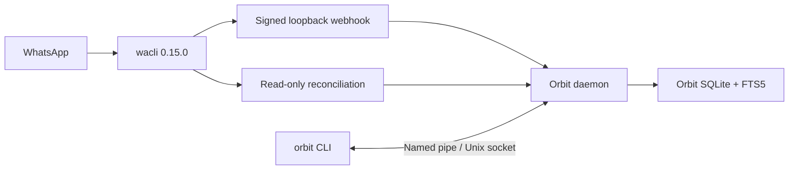

# Orbit

[](https://github.com/Rajikshank/orbit-wa-cli/actions/workflows/ci.yml)
[](https://www.rust-lang.org/)
[](LICENSE)

**A fast, local-first WhatsApp CLI with durable history, full-text search, and a supervised background sync.**

Orbit pairs as a WhatsApp linked device, mirrors messages into an Orbit-owned SQLite database, and exposes safe commands for people and scripts. Your session, message index, and audit trail stay on your computer.

> Orbit is an independent, unofficial project. It is not affiliated with, endorsed by, or sponsored by WhatsApp or Meta. Use it responsibly and never for spam or unsolicited messaging.

## Why Orbit?

- **One command surface** for pairing, sync, search, contacts, chats, media, and sending.
- **Local-first storage** under `~/.orbit`; no Orbit cloud account or telemetry.
- **Fast search** through an SQLite FTS5 index maintained from normalized events.
- **Reliable ingestion** through signed loopback webhooks plus idempotent reconciliation.
- **Quiet background sync** managed by the detached `orbitd` companion process.
- **Scriptable output** as complete, non-truncated JSON with meaningful exit codes.
- **Pinned connector** installation with SHA-256 verification for every supported platform.

## Current scope

This repository intentionally contains the WhatsApp phase only. It does not include a desktop UI, hosted service, LLM, MCP server, memory engine, or connectors for other applications.

| Capability | Status |
| --- | :---: |
| QR linked-device pairing | ✓ |
| Continuous incoming sync | ✓ |
| Chats, contacts, unread state, and history | ✓ |
| Local full-text search | ✓ |
| Text, images, video, audio, files, and voice notes | ✓ |
| On-demand media download | ✓ |
| Diagnostics, statistics, reconciliation, and audit records | ✓ |
| Multi-account profiles | Not yet |

## How it works



`wacli` owns the WhatsApp protocol session and its connector database. Orbit never writes those databases. It converts connector records into its own durable event store and searchable current-message projection.

## Requirements

- Windows 10/11, Linux, or macOS
- Rust 1.88 or newer to build from source
- A WhatsApp account that can add a linked device
- Internet access during `orbit setup` and WhatsApp synchronization

Supported connector downloads are Windows x64, Linux x64/ARM64, and macOS x64/Apple Silicon.

## Install

Clone and build both executables:

```bash
git clone https://github.com/Rajikshank/orbit-wa-cli.git
cd orbit-wa-cli
cargo build --locked --release --bins
```

Keep `orbit` and `orbitd` together in the same directory.

### Windows

The binaries are:

```text
target\release\orbit.exe
target\release\orbitd.exe
```

Copy both into a directory on your `PATH`, or run them directly from `target\release`:

```powershell
.\target\release\orbit.exe --version
```

### Linux and macOS

```bash
install -d "$HOME/.local/bin"
install -m 0755 target/release/orbit target/release/orbitd "$HOME/.local/bin/"
orbit --version
```

Ensure `$HOME/.local/bin` is on your `PATH`.

## First-time setup

### 1. Install the connector

```bash
orbit setup
```

Orbit downloads the platform-specific `wacli` 0.15.0 archive and verifies its pinned SHA-256 checksum before installation.

### 2. Pair WhatsApp

The daemon must be stopped during pairing. If it is already running, stop it first:

```bash
orbit daemon stop
```

Then start pairing:

```bash
orbit connect whatsapp
```

Open WhatsApp on your phone, go to **Linked devices → Link a device**, then scan the terminal QR code.

The first sync can take several minutes for a large account. Messages such as `Syncing history: ...` mean progress. Recoverable app-state or presence warnings may appear while a newly linked device receives its keys and profile; pairing is complete when the command returns to the prompt.

### 3. Start Orbit

```bash
orbit daemon start
orbit doctor
orbit status
```

`orbitd` keeps WhatsApp synchronized in the background. Starting it again is safe and returns `already_running`.

## Everyday usage

### Browse and search

```bash
orbit whatsapp chats --limit 20
orbit whatsapp unread --limit 20
orbit whatsapp contacts --limit 20
orbit whatsapp contacts "Alex" --limit 10
orbit whatsapp messages "CHAT_JID_OR_NAME" --limit 50

orbit search "project launch"
orbit whatsapp search "invoice" --chat "CHAT_JID"
orbit whatsapp search "meeting" --from "PHONE_OR_JID" --after 2026-08-01
```

Use the exact JID shown by `chats` when a display name is missing or ambiguous.

### Send messages and media

```bash
orbit whatsapp send "PHONE_OR_JID" "Hello from Orbit"

orbit whatsapp send "PHONE_OR_JID" --image ./photo.jpg --caption "Photo"
orbit whatsapp send "PHONE_OR_JID" --video ./demo.mp4 --caption "Demo"
orbit whatsapp send "PHONE_OR_JID" --audio ./audio.m4a
orbit whatsapp send "PHONE_OR_JID" --voice ./voice.ogg
orbit whatsapp send "PHONE_OR_JID" --file ./report.pdf --caption "Report"
```

A recipient may be a synchronized name, international phone number, or exact JID. Prefer the phone number or JID for automation. Orbit never guesses between ambiguous recipients and never automatically retries a failed send.

### Download media

Find the message ID and chat JID first:

```bash
orbit whatsapp messages "CHAT_JID" --limit 50
orbit whatsapp download "MESSAGE_ID" --chat "CHAT_JID"
```

Media is downloaded only when requested.

### Operations

```bash
orbit status
orbit stats
orbit doctor
orbit whatsapp reconcile

orbit daemon status
orbit daemon stop
orbit daemon start
```

`doctor` reports `connection_state: managed_by_daemon` while the daemon owns the connector lock. In that state, `connected` is `null` because a second probe cannot safely open the live session; the running sync process and recent activity timestamps provide the operational signals.

## JSON and automation

Commands print pretty JSON without truncating IDs. A non-zero exit code indicates failure, and warnings are written to stderr. `--json` is accepted globally for forward compatibility:

```bash
orbit --json status
orbit --json whatsapp search "release" --limit 5
```

For send operations, treat a successful response with a warning as **possibly delivered**. Do not blindly retry it; doing so may duplicate a real WhatsApp message.

## Data, privacy, and backup

All mutable state lives under `~/.orbit` by default:

```text
~/.orbit/
├── bin/                     # checksum-verified wacli driver
├── config.toml
├── connectors/whatsapp/
│   ├── session.db           # WhatsApp linked-device credentials
│   └── wacli.db             # connector-owned message store
├── logs/orbitd.log
└── orbit.db                 # normalized events, FTS, cursors, audit log
```

- The webhook binds only to IPv4 loopback and requires an HMAC signature.
- CLI traffic uses a non-network Windows named pipe or a private Unix socket.
- Unix state directories use owner-only permissions.
- Message bodies and attachment contents are not copied into the send audit log.
- Orbit has no telemetry and does not upload its database anywhere.

Back up the whole `~/.orbit` directory while the daemon is stopped. Treat the backup as sensitive: `session.db` contains credentials for the linked WhatsApp device.

To use an isolated profile or test directory:

```bash
orbit --home ./my-orbit-profile setup
orbit --home ./my-orbit-profile daemon run
```

## Configuration

`orbit setup` creates `~/.orbit/config.toml`:

```toml
webhook_port = 38217
reconcile_interval_seconds = 60
reconcile_limit = 1000
max_messages = 250000
max_database_size = "2GB"
```

Restart the daemon after editing configuration. `wacli_path` may point to a compatible custom `wacli` 0.15.0 binary, but the checksum-verified bundled installation is recommended.

## Troubleshooting

### No QR code appears

Confirm you are running a current build and that the daemon is stopped:

```bash
orbit daemon stop
orbit connect whatsapp
```

Orbit requests terminal QR rendering; it should not open or print a `wa.me` link.

### Initial sync looks slow

Leave the pairing terminal open while the database is growing. WhatsApp sends history in batches, and Orbit waits for 30 seconds of idle time after the final batch. App-state key, temporary websocket, or early `PushName` warnings are recoverable when message counts continue increasing.

### Connector lock errors

Only one pairing or sync process may own the WhatsApp store. During normal operation the daemon owns it. Stop the daemon before pairing, and do not launch `wacli` directly against `~/.orbit/connectors/whatsapp`.

### Daemon does not start

Keep `orbit` and `orbitd` beside each other, then inspect:

```bash
orbit doctor
```

Daemon logs are written to `~/.orbit/logs/orbitd.log`.

## Development and verification

```bash
cargo fmt --all -- --check
cargo check --locked --all-targets
cargo test --locked --all-targets
cargo clippy --locked --all-targets --all-features -- -D warnings
cargo build --locked --release --bins
cargo audit
```

CI runs formatting, compilation, tests, strict Clippy, and release builds on Windows, Linux, and macOS. RustSec auditing runs separately against the committed lockfile.

## Operational limitations

- WhatsApp Web history is best effort and may not include the account's complete lifetime history.
- The daemon is detached but is not installed as an operating-system startup service.
- Actual availability depends on WhatsApp Web protocol compatibility and the pinned connector release.
- Bulk messaging, scraping, marketing automation, and unsolicited outreach are outside the intended use of Orbit.

## License

[MIT](LICENSE) © 2026 Rajikshan
